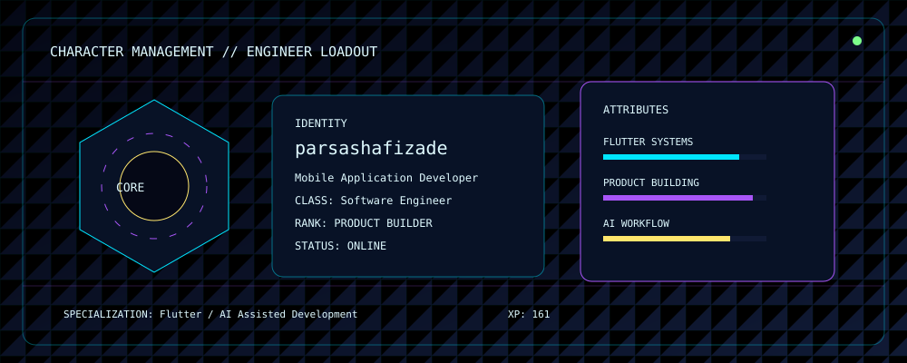
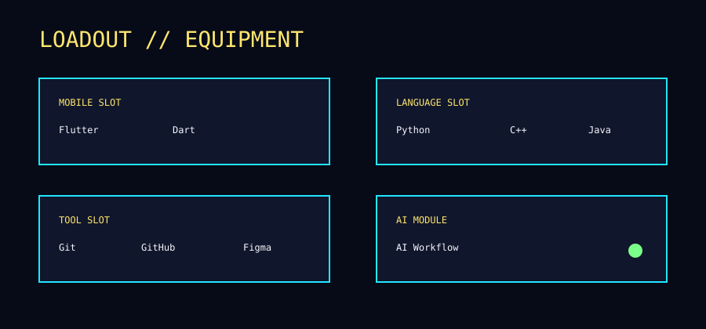
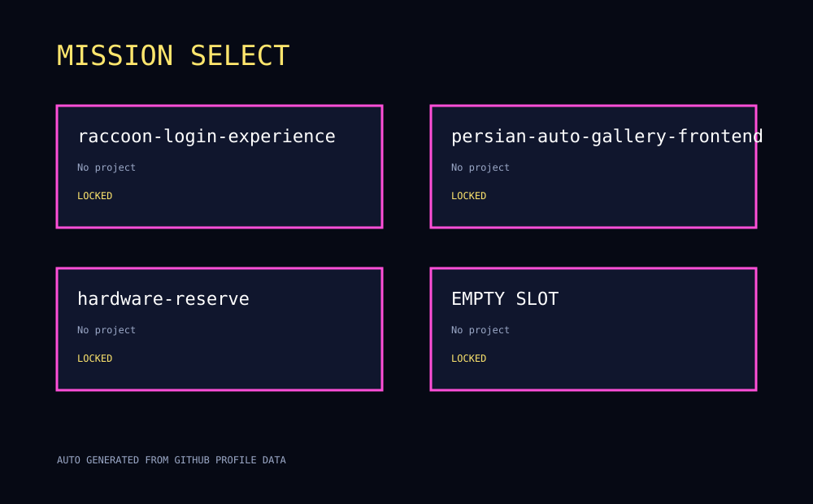
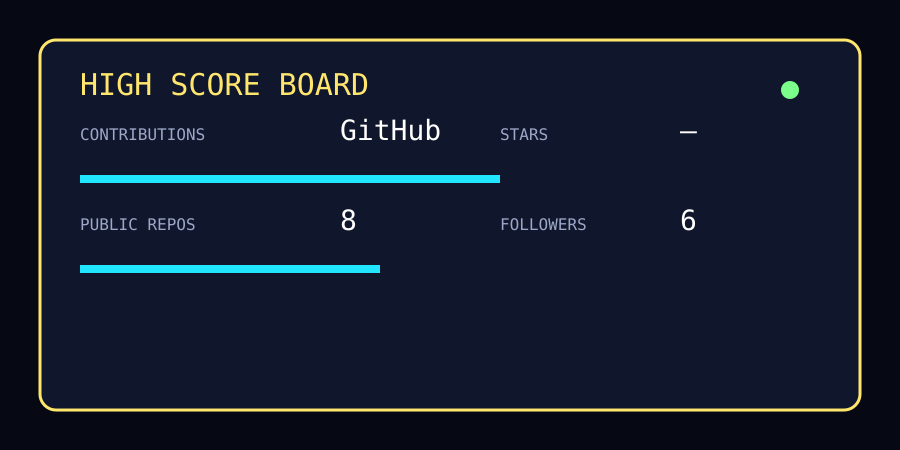
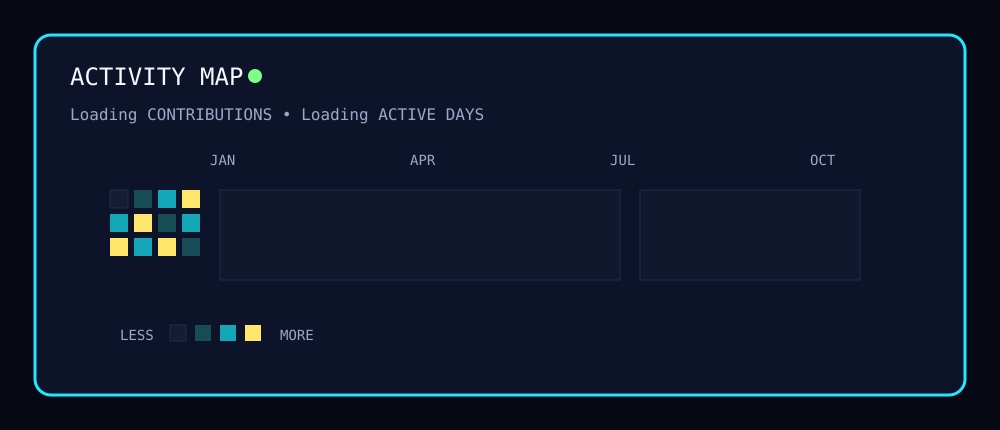
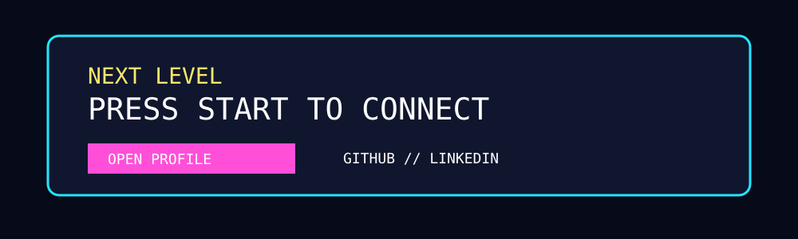

 

 

 

 

 

 

<picture>
  <source media="(prefers-color-scheme: dark)" srcset="./assets/snake/github-contribution-grid-snake-dark.svg">
  <source media="(prefers-color-scheme: light)" srcset="./assets/snake/github-contribution-grid-snake.svg">
  
</picture>

 

