 

&nbsp;

&nbsp;

 

## About

I’m **Parsa Shafizade**, a Mobile Application Developer focused on building practical digital products from idea to implementation.

My primary focus is **cross-platform mobile development with Flutter**, supported by product thinking, software engineering fundamentals, backend understanding, APIs, databases, and AI-assisted development workflows.

I approach development as more than implementing screens or features. I care about understanding the problem, making deliberate product decisions, building maintainable systems, shipping usable solutions, and improving them through iteration.

 

  

 

## What I'm focused on

 

- **Mobile Development** — building cross-platform applications with Flutter and strengthening the engineering foundations behind reliable mobile products.
- **Product Development** — connecting technical execution with actual user problems, product decisions, usability, and practical value.
- **AI-assisted Development** — using AI as an engineering accelerator for exploration, implementation, debugging, reasoning, and iteration.
- **Continuous Improvement** — improving architecture, software design, APIs, databases, development workflows, and overall engineering judgment.

 

  

 

## Selected Work

A rotating selection of recent repositories that are mature enough to represent my current work.

<!--
Premium project cards are generated automatically by:
Premium/scripts/generate-project-cards.py

The generator evaluates recency, maturity, README quality, code presence,
development activity and repository visibility before selecting projects.

Private repositories are never surfaced unless explicitly marked
with the `profile-showcase` topic.
-->

  
  
   
  
  

Selected automatically from recent repositories using portfolio-quality and visibility rules.

 

  

 

## Engineering Toolkit

### Core

  
  
  
  

### Supporting

  
  
  
  
  
  
  
  

 

  

 

## How I approach building products

<table>
<tr>
<td width="25%" valign="top">

### 01 · Understand

Clarify the actual problem before committing to implementation.

</td>
<td width="25%" valign="top">

### 02 · Build

Turn product decisions into working software with clear technical foundations.

</td>
<td width="25%" valign="top">

### 03 · Ship

Prioritize usable, practical execution over unnecessary complexity.

</td>
<td width="25%" valign="top">

### 04 · Improve

Learn from the result, refine the system, and make the next iteration stronger.

</td>
</tr>
</table>

 

  

 

## GitHub Activity

 

 

  

 
## Beyond the code

I’m working toward becoming a stronger **Mobile / Software Engineer** who can understand both the engineering system and the product it exists to serve.

That means continuously improving not only implementation skills, but also architecture, debugging, technical decision-making, product judgment, communication, and the ability to move efficiently from ambiguity to a working product.

 

  

 

## Let's connect

If you're working on a mobile product, software engineering challenge, or an interesting product-focused project, I’m always open to a useful conversation.

&nbsp;

 

Mobile Development · Product Thinking · Software Engineering · AI-assisted Development

